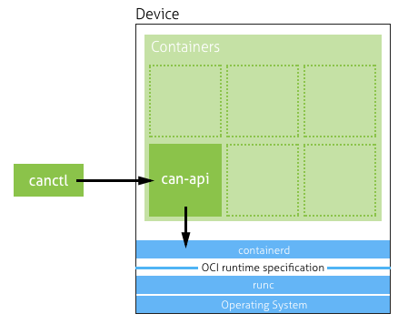

# CAN
> Note: this is early alpha version! There's not all features yet implemented and code might get large breaking changes until the first release.

Can is a open source system for managing containerized applications on top of the IoT device with an emphasis to usability, simplicity and security.

Docker and Kubernetes have inspired heavily and if you're familiar with them, you find really easy to get started with Can.

<sub>Built with ❤︎ by [Erno Aapa](https://github.com/ernoaapa) and [contributors](https://github.com/ernoaapa/can)</sub>

## Usage


Can is based on top of the [containerd](https://github.com/containerd/containerd) to provide simple API for managing containers. 

Can is built from following components
- `canctl` - Command line tool for managing the device
- `can-api` - GRPC API for client to manage containers
- `can-discovery` - _(Optional)_ component to make device automatically discoverable by the `canctl` client

### What is pod?
A _Pod_ is a group of one or more containers what are tightly coupled to each other to build the service. Often the _pod_ contains only one container but sometimes you need some external service, for example in-memory database, addition to your process. In this case, both containers should be in the same pod.

### Features
- Manage running pods (softwares) in the device
- Attach to container remotely for debugging
- _develop-in-device_ fast development start

### Get list of devices
```
# List all the devices what are discoverable in the network
canctl get devices
```

### Start new pod
`canctl` creates pods based on `yaml` configuration file.
```shell
cat <<EOF >> pods.yaml
metadata:
  name: "node-hello"
spec:
  containers:
    - name: "hello-world"
      image: "docker.io/eaapa/hello-world:latest"
EOF
```
> Note: You can define multiple pods in same yaml file by separating them with `---` line.

```shell
canctl create -f pods.yaml
```

### List running pods
```
canctl get pods
```

### View details of pod
```
canctl describe pod <pod name>
```

## Installation
### Prerequisites
- containerd - [see the installation docs](https://github.com/containerd/containerd/blob/master/docs/getting-started.md)
- [runc](https://github.com/opencontainers/runc) (required by containerd)

### Install
`can-api` is just single binary what you can download from releases or build as described below.
By default `can-api` uses `/run/containerd/containerd.sock` socket file to connect containerd.
If you have the file somewhere else, please provide `--containerd` flag.

### Install from releases
TODO

### Build from the sources
Install Go 1.9.x and clone the repository to your `$GOPATH`
```
BIN=can-api make build
BIN=canctl make build
```

## Development
See the [development getting started](docs/development-getting-started.md) documentation.